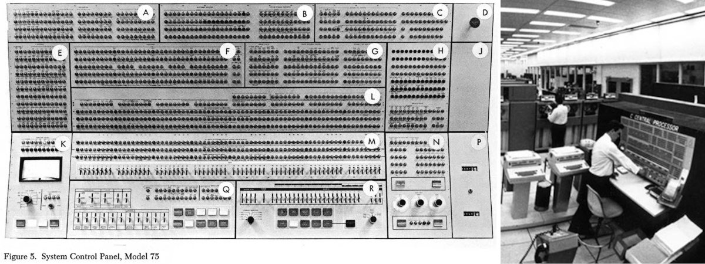

# El Cosmos Computacional, primera parte

Cómo la Informática Impulsa la Exploración del Universo.

Guillermo Valdés (@guivaloz)

Abril 2025

---

# Contenido

1. Introducción
2. Calculando los cielos
3. Lanzando la era digital

---

# I. Introducción

La astronomía, el estudio de los objetos y fenómenos celestes, y la exploración espacial, nuestra aventura física más allá de la Tierra, presentan desafíos computacionales intrínsecos.

Calcular las órbitas de los planetas, predecir eclipses, analizar la luz de estrellas distantes, guiar naves espaciales a través de vastas distancias y procesar los enormes volúmenes de datos generados por telescopios y sondas son tareas que exigen una capacidad de cálculo cada vez mayor.

---

# II. Calculando los Cielos

La necesidad de calcular y predecir los movimientos celestes es tan antigua como la propia astronomía. Mucho antes de la era digital, la complejidad de los ciclos astronómicos impulsó la innovación en herramientas computacionales.

---

# El Mecanismo de Anticitera

---

# El Mecanismo de Anticitera

Descubierto en 1901 entre los restos de un naufragio cerca de la isla griega de Anticitera, el Mecanismo de Anticitera, datado alrededor del 150-100 a.C. 1 (aunque otras dataciones sugieren ~200 a.C. o incluso 205 a.C.), representa el ejemplo más antiguo conocido de una computadora analógica.

Este intrincado dispositivo, compuesto por al menos 37 engranajes de bronce meticulosamente elaborados, estaba diseñado para predecir posiciones astronómicas, como las del Sol y la Luna, y los eclipses solares y lunares con décadas de antelación.

---

# Las "Computadoras" de Harvard

---

# Las "Computadoras" de Harvard

El director del observatorio, Edward Charles Pickering, se enfrentó al desafío de cómo procesar esta enorme cantidad de información. Su solución fue contratar a un equipo de mujeres, conocidas informalmente como las "Computadoras de Harvard" (o, de forma más despectiva en la época, el "Harén de Pickering"), para realizar el meticuloso trabajo de analizar las placas fotográficas.

A menudo con salarios inferiores a los de sus homólogos masculinos y sin necesariamente tener formación especializada en astronomía, estas mujeres se convirtieron en expertas procesadoras de datos. Sus tareas incluían medir con precisión las posiciones y brillos de miles de estrellas y, fundamentalmente, clasificar sus espectros.

---

# Cálculos para Cohetes

---

# Cálculos para Cohetes

A diferencia de la catalogación astronómica, que podía realizarse durante un período prolongado, la cohetería imponía severas restricciones de tiempo real. La verificación de la trayectoria y las posibles correcciones debían realizarse rápidamente durante el lanzamiento y las maniobras.

La velocidad y la complejidad de estos cálculos, especialmente para misiones tripuladas como Apolo donde los errores podían ser catastróficos, superaron rápidamente las capacidades humanas para garantizar la velocidad y fiabilidad necesarias.

---

# III. Lanzando la Era Digital

La segunda mitad del siglo XX marcó la convergencia definitiva de la exploración espacial y la revolución informática. Las misiones se volvieron más ambiciosas, exigiendo soluciones computacionales innovadoras tanto a bordo de las naves espaciales como en los centros de control en tierra.

---

# Guiando el Apolo a la Luna

---

# Guiando el Apolo a la Luna

El programa Apolo de la NASA, con su objetivo audaz de llevar humanos a la Luna y traerlos de vuelta a salvo, representó un salto cuántico en complejidad respecto a misiones anteriores. Lograrlo requirió una precisión sin precedentes en la guía, navegación y control (GNC), tareas que dependían críticamente de la computación.

---

# El Apollo Guidance Computer (AGC)

---

# El Apollo Guidance Computer (AGC)

El corazón computacional a bordo de las naves Apolo fue el AGC. Desarrollado por el MIT Instrumentation Laboratory (ahora Draper Labs) y fabricado por Raytheon, el AGC fue una maravilla de la ingeniería para su época.

Fue uno de los primeros ordenadores en utilizar circuitos integrados (CI) de silicio, una tecnología entonces emergente. A pesar de su tamaño compacto (aproximadamente 0.03-0.06 metros cúbicos y un peso de 32 kg), contenía miles de CIs. Su memoria consistía en unos 2K palabras (de 16 bits: 15 de datos + 1 de paridad) de memoria RAM de núcleo magnético (reescribible) y unas 36K palabras de memoria ROM de "núcleo de cuerda" (core rope memory), una forma tejida a mano de memoria de solo lectura. Su procesador, basado en lógica resistor-transistor (RTL), funcionaba a unos 2 MHz, ofreciendo un rendimiento comparable al de los primeros ordenadores domésticos de finales de los 70.

---

# Control Terrestre: IBM System/360

---

# Control Terrestre: IBM System/360

Mientras el AGC operaba a bordo, la gestión global de la misión Apolo recaía en una vasta red de computadoras en tierra. NASA necesitaba una capacidad computacional masiva para manejar el inmenso flujo de datos de telemetría, realizar cálculos de trayectoria complejos, monitorizar el estado de las naves y gestionar las comunicaciones. Para ello, recurrió a IBM y su entonces novedosa serie de mainframes System/360.

---

# Margaret Hamilton y su código

---

# El Gran Tour del Voyager

---

# El Gran Tour del Voyager

Esta odisea de décadas a través de entornos desconocidos y a distancias cada vez mayores de la Tierra exigía sistemas computacionales excepcionalmente robustos y adaptables.

Las Voyager estaban equipadas con tres tipos de sistemas informáticos, cada uno duplicado por redundancia. Estos no utilizaban microprocesadores, sino que estaban construidos con componentes discretos de lógica TTL y CMOS. La memoria total combinada era modesta para los estándares actuales, alrededor de 69 kilobytes.

---

# El Gran Tour del Voyager

Una característica verdaderamente revolucionaria de las computadoras Voyager fue su reprogramabilidad. Esta flexibilidad resultó crucial para la longevidad y el éxito extendido de la misión:

- A medida que las naves se alejaban y la señal se debilitaba, se reprogramaron los ordenadores para utilizar métodos de compresión de datos más eficientes.
- Permitió extender la misión de Voyager 2 para incluir sobrevuelos de Urano y Neptuno, objetivos no planeados originalmente.
- Ha permitido realizar nuevas investigaciones científicas en el espacio interestelar, muy diferentes de los objetivos originales.
- Incluso décadas después del lanzamiento, el equipo ha podido diagnosticar y reprogramar las computadoras para solucionar problemas.

---

# La Visión del Hubble

---

# La Visión del Hubble

**Computación a Bordo:**  El Hubble utiliza computadoras a bordo para controlar sus operaciones, mantener un apuntamiento extremadamente preciso, gestionar los instrumentos científicos, almacenar comandos (hasta 24 horas) y manejar el flujo de datos. Estas computadoras han sido actualizadas durante las misiones de servicio.

**Sistemas Terrestres (STScI):** El centro neurálgico de las operaciones científicas del Hubble es el Space Telescope Science Institute (STScI) en Baltimore, Maryland.

---

# La Visión del Hubble

**COSTAR: Corrección Computacional:** Poco después del lanzamiento, se descubrió un grave defecto (aberración esférica) en el espejo principal del Hubble. La solución fue COSTAR (Corrective Optics Space Telescope Axial Replacement), un complejo instrumento instalado durante la primera misión de servicio en 1993.

COSTAR contenía un juego de pequeños espejos correctores diseñados con precisión basándose en modelos computacionales detallados de la aberración del espejo principal. Actuando como "gafas" para los instrumentos originales, restauró la visión del Hubble.

---

# Tabla I

| Proyecto/Misión/Descubrimiento | Era/Año | Rol Clave / Innovación |
| -- | -- | -- |
| Mecanismo de Anticitera | ~150-100 a.C. | Primera computadora analógica conocida para predicción astronómica |
| Computadoras de Harvard | Finales s.XIX/ Principios s.XX | Computación humana para clasificación estelar a gran escala a partir de placas fotográficas |
| Computadoras Humanas del JPL | 1940s-1960s | Cálculo manual de trayectorias y telemetría para cohetes/naves tempranas |

---

# Tabla I

| Proyecto/Misión/Descubrimiento | Era/Año | Rol Clave / Innovación |
| -- | -- | -- |
| Programa Apolo (AGC) | 1960s | Primer uso de CIs en el espacio, GNC a bordo, interfaz DSKY |
| Programa Apolo (Tierra) | 1960s | Mainframes IBM S/360 para control de misión, procesamiento de datos, simulación |

---

# Tabla I

| Proyecto/Misión/Descubrimiento | Era/Año | Rol Clave / Innovación |
| -- | -- | -- |
| Programa Voyager | 1977-Presente | Computadoras a bordo redundantes y reprogramables (CCS, AACS, FDS) para autonomía y adaptación |
| Telescopio Espacial Hubble | 1990-Presente | Sistemas terrestres sofisticados (STScI) para planificación (Spike), procesamiento, archivo (MAST); computadoras a bordo; corrección COSTAR |

---
